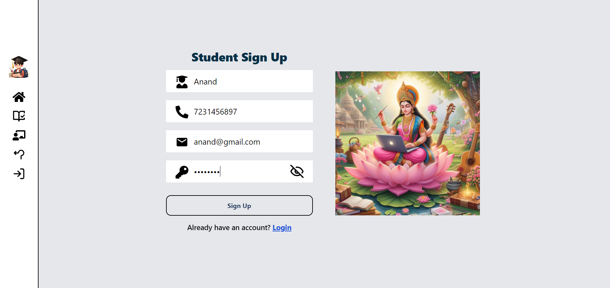
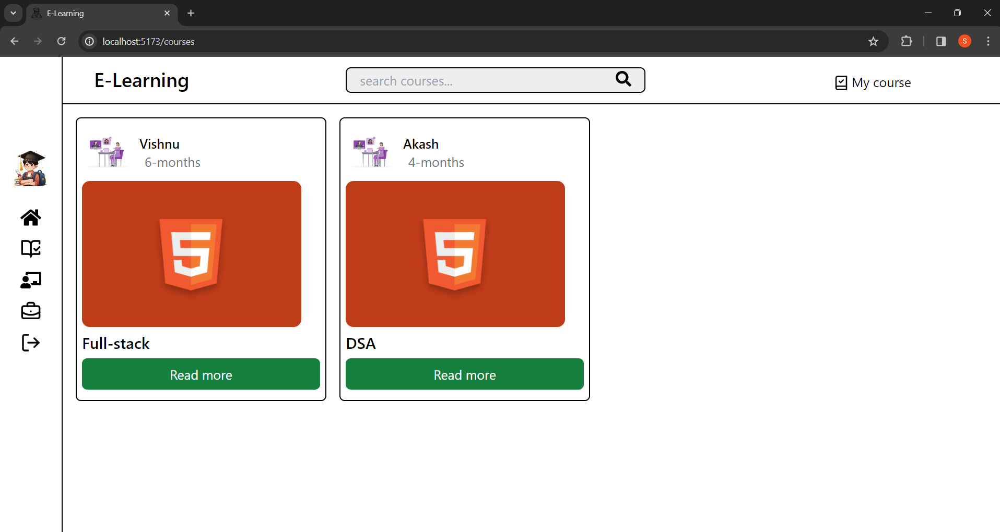
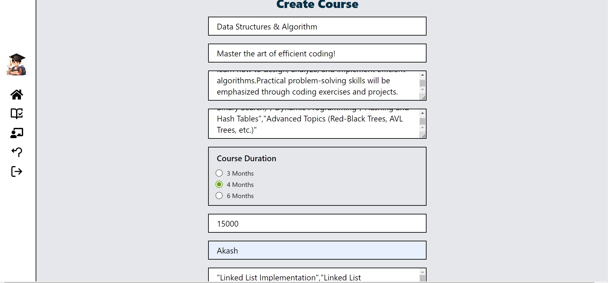
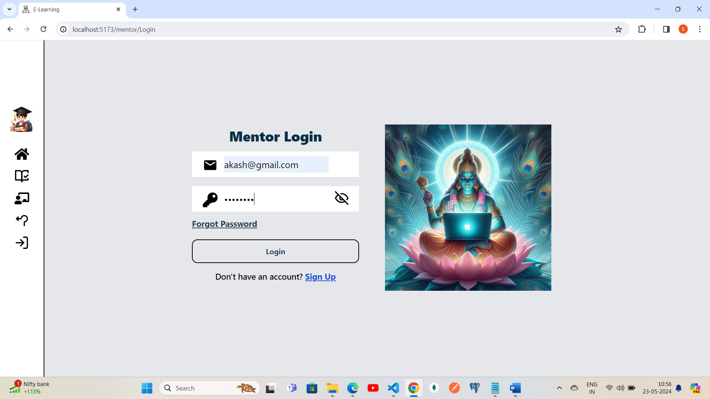
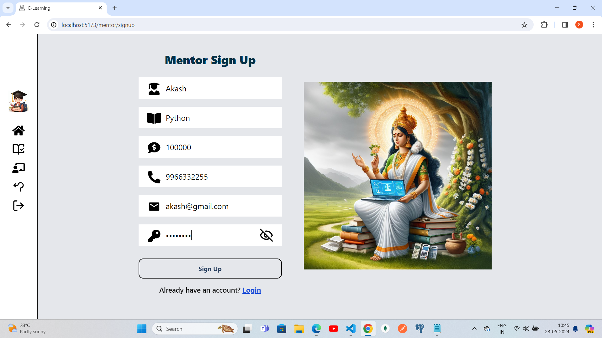
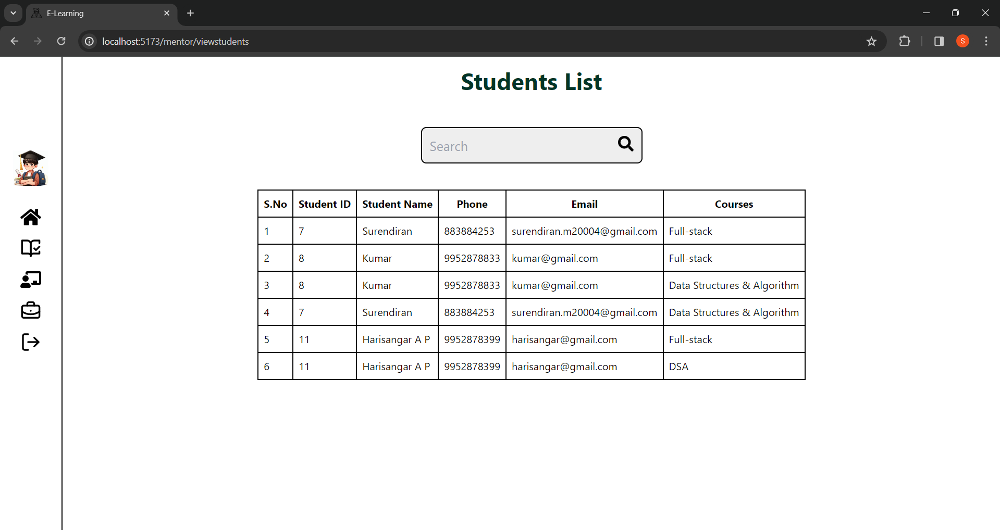
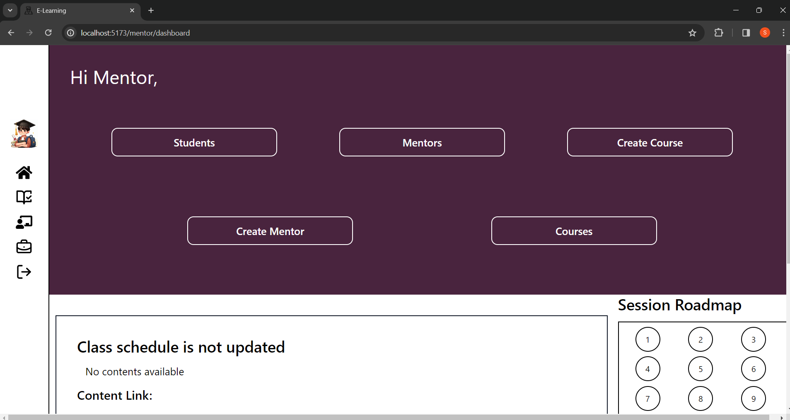

# GenZ-Learning Platform
GenZ-Learning is an E-learning platform designed specifically for class students to efficiently manage extra classes. Recognizing that today's students are highly productive, we built this platform to cater to their needs in an online learning environment.

<a href="https://drive.google.com/file/d/1j-tytDuK6eyXBPEIfMgkswHGdKeJnyWY/view?usp=drive_link">Demo Video</a>

## Features
 ### For Students:
- **Sign In/Sign Up:** Students can easily create accounts and log in.
- **Change Password:** Option to update their password.
- **Enroll in Courses:** Students can browse and enroll in available courses.
- **Attend Classes:** Join sessions via provided links for each class.
- **View Course Content:** Access materials and resources for their enrolled courses.
- **Track Attendance:** View their attendance record for each course.
  
  
  
  
  
  
### For Mentors:
- **Create and Manage Courses:** Add new courses and update existing ones.
- **Manage Sessions:** Schedule and provide links for each class.
- **Track Attendance:** Monitor and record student attendance.
- **Manage Course Content:** Upload and organize course materials.
 
 
 
 
 
## Technology Stack
 - **Frontend:** ReactJS, React-Toastify, TailwindCSS, Lucide-Icons
 - **Backend:** Node.js, ExpressJS, Nodemailer
 - **Database:** PostgreSQL (hosted on Neon Cloud)
 - **Authentication:** JSON Web Tokens (JWT) for user authentication and authorization
 - **State Management:** context Api for state management
 - **Email:** Nodemailer for sending emails
 - **Security:** bcrypt,a hashing technique for hashing password for security
 - **Api Handling:** efficiently managed API calls by implementing Fetch,Try & catch blocks for fetching data from Backend Api's synchronously and also used asynchronous functions in both the frontend and backend, and by structuring the code modularly.

## Database Design
- **Normalization:** Ensured data integrity and reduced redundancy by normalizing tables.
- **Integrity Constraints:** Implemented constraints to maintain data accuracy and reliability. 
Cursors, Triggers, Procedures: Utilized these for:  
  1.Counting the number of students per course  
  2.Calculating attendance  
  3.Summing up the total fees paid by students across courses  

This project was developed by me and my friend. Together, we designed the system architecture, implemented the database design, and developed the frontend and backend.

